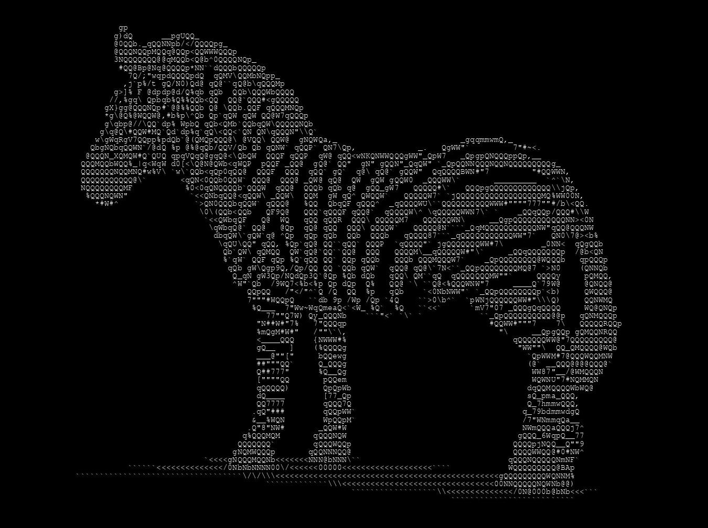

## Similarity-based Asciify

Python class to asciify an image by subimage-character similarity, as opposed to intensity base mapping.
Similarity is measured by euclidean distance.


Example usage:
```sh
inst = AsciiArt()
img = inst.asciify('some_image.jpg')
img.save('asciified_image.jpg')
```


